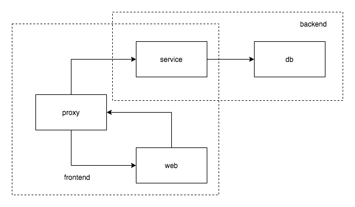

# Docker Practice

### Service Diagram



There are two networks: `frontend` and `backend`.

### Run
1. Run this command to build images:
```shell script
docker-compose build
```

2. Run this command start service:
```shell script
docker-compose up
```

3. Need to create the user table in DB manually.

```sql
create table user(id int(50) not null auto_increment primary key , name VARCHAR(20), age int);
```
